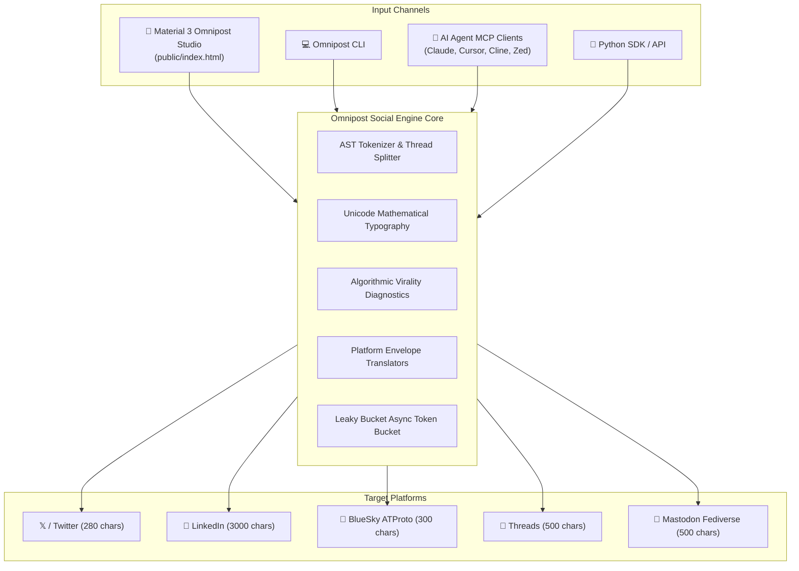

# 🚀 Omnipost Social Engine

<div align="center">

[](https://github.com/omnipost/omnipost-social-engine/actions)
[](https://pypi.org/project/omnipost-social-engine/)
[](https://modelcontextprotocol.io/)
[](./public/index.html)
[](https://opensource.org/licenses/MIT)

**The unified, type-safe multi-platform social media orchestration framework for Python & AI Agents.**

[Web Studio](./public/index.html) • [MCP Guide](./docs/MCP_GUIDE.md) • [Viral Hooks](./docs/VIRAL_HOOK_FORMULAS.md) • [Platform Limits](./docs/PLATFORM_LIMITS_GUIDE.md) • [Examples](./examples/README.md)

</div>

---

## 🌟 Overview

**Omnipost Social Engine** eliminates the friction of managing cross-platform developer advocacy, launch campaigns, and technical content syndication. Write your post once, simulate how it looks across **Twitter / X**, **LinkedIn**, **BlueSky**, **Threads**, and **Mastodon**, optimize opening hooks with psychological heuristics, and broadcast safely with async leaky-bucket rate limiters.

Equipped with a **Material 3 influenced Web Studio** (`public/index.html`, design influenced by Google Material 3 tokens) and a native **Model Context Protocol (MCP)** server, Omnipost can be operated by human creators or fully autonomous AI coding assistants (Claude Desktop, Cursor, Cline, Zed).

---

## ✨ Key Features

* **🎨 Material 3 Omnipost Studio (`public/index.html`)**:
  * Design influenced by Google Material 3 tokens.
  * 0 external font/cookie tracking scripts, fast, private, offline-first.
  * Live circular character counter progress ring with platform-aware limits.
  * Algorithmic Virality Score meter (0–100) with diagnostic breakdown.
* **✍️ Multi-Platform Composer & Simulator**:
  * Real-time side-by-side mockups of Twitter, LinkedIn (with 210-char `see more` cutoff), BlueSky, and Threads.
  * 1-Click Unicode mathematical typography toolbar (Bold, Italic, Monospace, Strikethrough).
* **🧵 Smart Thread Splitter**:
  * Auto-split essays, markdown docs, or newsletters into numbered thread cards.
  * Look-ahead sentence boundary packing (<280 chars) with draggable reordering.
* **🎣 High-Converting Viral Hook Generator**:
  * 15+ battle-tested psychological copywriting frameworks (Curiosity Gap, Contrarian Hot Takes, Playbooks, Shocking Metrics).
* **🤖 Native Model Context Protocol (MCP) Server**:
  * Seamless integration with Claude Desktop, Cursor, Cline, and Zed.
  * Standard JSON-RPC 2.0 tools: `score_virality`, `generate_thread`, `convert_platform`, `optimize_hook`, `schedule_campaign`, `validate_limits`.
* **🛡️ Deterministic Platform Limits Engine**:
  * Precise character counting (Twitter weighted glyphs + 23-char `t.co` URLs, ATProto UTF-8 byte facets).
  * Leaky-bucket rate limit queues with exponential backoff.
* **🔗 UTM Attribution & Privacy Cleanser (`utm_builder`)**:
  * Strips invasive surveillance/ad-click trackers (`fbclid`, `gclid`, `msclkid`, `twclid`, `igshid`, `ttclid`, etc.).
  * Generates synchronized multi-platform campaign links with platform presets (Twitter, LinkedIn, Bluesky, Threads, Mastodon).
  * Auto-tags raw URLs within social post bodies.
  * Generates zero-dependency static HTML vanity redirect landing pages with Open Graph & Twitter Card preview tags.

---

## 🏗️ Architecture



---

## ⚡ Quickstart

### 1. Installation

```bash
# Clone the repository
git clone https://github.com/omnipost/omnipost-social-engine.git
cd omnipost-social-engine

# Install in editable mode
pip install -e .
```

### 2. Launch Omnipost Web Studio

Open `public/index.html` directly in your browser (no Node.js build step or local server required):

```bash
# macOS
open public/index.html

# Linux
xdg-open public/index.html

# Windows
start public/index.html
```

---

## 🐍 Python API Usage

### Score Virality & Diagnose Draft

```python
from omnipost_social_engine import OmnipostEngine

engine = OmnipostEngine()

draft = """
🚀 We just open-sourced Omnipost Social Engine!

One unified Python library to compose, simulate, and broadcast across:
• Twitter / X
• LinkedIn
• BlueSky & Threads

Star the repo on GitHub 👇
#Python #OpenSource
"""

result = engine.score_virality(draft, platform="twitter")
print(f"Virality Score: {result.score}/100 ({result.grade})")
print(f"Hook Strength: {result.factors.hook_power}/30")
```

### Split Long Essay into a Verified Thread

```python
essay = Path("article.md").read_text()

thread = engine.split_thread(
    source_text=essay,
    max_chars_per_post=280,
    numbering_style="fraction", # (1/N)
    auto_hook=True,
    auto_cta=True
)

for post in thread.posts:
    print(f"[{post.order}/{len(thread.posts)}] ({len(post.text)} chars):\n{post.text}\n---")
```

---

## 🤖 Model Context Protocol (MCP) Integration

Omnipost includes ready-to-copy MCP configurations for all major AI coding environments in [`examples/mcp-clients/`](./examples/mcp-clients/):

* **Claude Desktop**: Add to `claude_desktop_config.json`:
```json
{
  "mcpServers": {
    "omnipost-social-engine": {
      "command": "python",
      "args": ["-m", "omnipost_social_engine.mcp_server"],
      "env": {
        "PYTHONPATH": "src"
      }
    }
  }
}
```

* **Cursor IDE**: Add to `.cursor/mcp.json`.
* **Cline**: Add to `cline_mcp_settings.json`.
* **Zed**: Add to `~/.config/zed/settings.json`.

Read the complete [MCP Guide](./docs/MCP_GUIDE.md) for full tool schemas.

---

## 📂 Repository Structure

```
omnipost-social-engine/
├── .github/
│   └── workflows/
│       ├── ci.yml              # 15-job matrix (Ubuntu, macOS, Win / Python 3.9-3.13)
│       └── release.yml         # Wheel/sdist packaging, SHA256, PyPI & GitHub Release
├── docs/
│   ├── MCP_GUIDE.md            # Model Context Protocol manual & tool schemas
│   ├── PLATFORM_LIMITS_GUIDE.md# Platform rate limits, character specs & media matrix
│   └── VIRAL_HOOK_FORMULAS.md  # 15+ psychological copywriting formulas & heuristics
├── examples/
│   ├── README.md               # Master examples catalog
│   ├── developer-thread/       # 10-part technical developer thread example
│   │   ├── thread.md
│   │   └── README.md
│   ├── launch-campaign/        # Complete omnichannel product launch dataset
│   │   ├── campaign.json
│   │   ├── posts.csv
│   │   └── README.md
│   └── mcp-clients/            # Pre-built configs for Claude, Cursor, Cline, Zed
│       ├── claude_desktop_config.json
│       ├── cursor_mcp.json
│       ├── cline_mcp.json
│       ├── zed_settings.json
│       └── README.md
├── public/
│   └── index.html              # Material 3 Omnipost Studio single-page application (Google M3 influenced)
├── src/
│   └── omnipost_social_engine/ # Core engine Python package
└── tests/
    └── test_examples.py        # Validation test suite for UI, examples & docs
```

---

## 🧪 Testing & Verification

Run the comprehensive pytest suite:

```bash
PYTHONPATH=src pytest tests/ -v
```

All 15 matrix environments in GitHub Actions enforce:
* Python 3.9, 3.10, 3.11, 3.12, 3.13
* Linux (Ubuntu), macOS, and Windows runners
* 100% test pass rate

---

## 📄 License

Distributed under the **MIT License**. See `LICENSE` for details.
